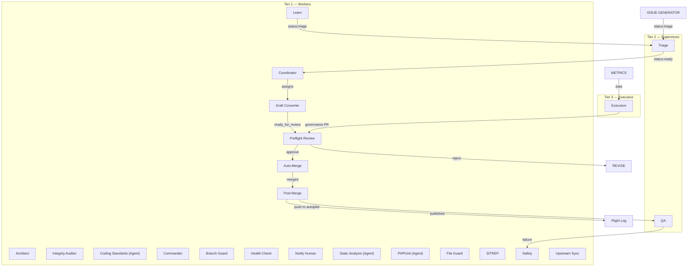

# Architecture

Auto-generated on 2026-04-16 by the Architect workflow. Do not edit manually.

## System Overview

**22 agent workflows** across 3 tiers, plus 3 composite action(s).

## Diagram

## Workflows

| Name | File | Tier | Triggers | Schedule |
|---|---|---|---|---|
| Architect | `agent-architect.yml` | Worker | schedule, manual, push | `0 0 * * 1` |
| Integrity Auditor | `agent-auditor.yml` | Worker | schedule, manual | `0 5 * * *` |
| Post-Merge | `agent-cleanup.yml` | Worker | PR event | — |
| Coding Standards (Agent) | `agent-coding-standards.yml` | Worker | manual | — |
| Commander | `agent-commander.yml` | Worker | issue event | — |
| Coordinator | `agent-coordinator.yml` | Worker | schedule, manual, issue event | `0 * * * *` |
| Executive | `agent-executive.yml` | Executive | schedule, manual | `0 6 * * 4` |
| Branch Guard | `agent-guard.yml` | Worker | PR event | — |
| Health Check | `agent-health-check.yml` | Worker | schedule, manual | `0 6 * * *` |
| Learn | `agent-learn.yml` | Worker | manual, PR event, issue event | — |
| Auto-Merge | `agent-merge.yml` | Worker | schedule, manual, review, check_suite | `*/30 * * * *` |
| Notify Human | `agent-notify.yml` | Worker | issue event | — |
| Static Analysis (Agent) | `agent-phpstan.yml` | Worker | manual | — |
| PHPUnit (Agent) | `agent-phpunit.yml` | Worker | manual | — |
| File Guard | `agent-protected-files.yml` | Worker | PR event | — |
| QA | `agent-qa.yml` | Supervisor | schedule, manual, push | `0 4 * * *` |
| Draft Converter | `agent-ready.yml` | Worker | schedule, manual, check_suite | `*/10 * * * *` |
| SITREP | `agent-reflection.yml` | Worker | schedule, manual | `0 0 * * 5` |
| Preflight Review | `agent-review.yml` | Worker | manual, PR event, check_suite | — |
| Safety | `agent-safety.yml` | Worker | schedule, manual, PR event, check_suite | `0 * * * *` |
| Upstream Sync | `agent-sync-upstream.yml` | Worker | schedule, manual | `0 3,9,15,21 * * *` |
| Triage | `agent-triage.yml` | Supervisor | manual, issue event | — |

## Composite Actions

- `escalate-to-human`
- `publish-to-flight-log`
- `read-from-flight-log`

## Review Personas

The Preflight Review workflow uses three AI personas loaded from `.github/agent-personas/`:

| Persona | Role | Rubric | Checks |
|---|---|---|---|
| Doc | Code Quality | Readability, PHPDoc, Complexity, Tests, Style | Every PR |
| Dalton | Security | Input Sanitization, Output Escaping, SQL Prep, Capability Checks, Nonce Verification, Attack Surface | Every PR |
| Pat | Compatibility + Decision | Function Signatures, Hook Compatibility, Return Types, Deprecation Path | Every PR (final verdict) |

## Coverage Matrix

| Component | Operates | Checked By | Checks the Checker | Gap |
|---|---|---|---|---|
| Coding Agents | Write code | Preflight Review (Doc, Dalton, Pat) | Executive (gap detection) | — |
| Coordinator | Assigns issues | Safety (capacity limits) | Executive (gap detection) | — |
| Draft Converter | Converts drafts | Safety (pipeline freeze) | Executive (gap detection) | — |
| Preflight Review | Reviews PRs | Metrics (approval rate) | Executive (aggregate trends) | No per-review audit |
| Doc (persona) | Quality checklist | Metrics (pass rates) | Executive (calibration drift) | No second opinion on individual reviews |
| Dalton (persona) | Security checklist | Metrics (pass rates) | Executive (calibration drift) | No second opinion on individual reviews |
| Pat (persona) | Final decision | Metrics (approval rate) | Executive (trend analysis) | No override mechanism besides human kill switch |
| Triage | Evaluates issues | Executive (rejection rate) | Executive (gap detection) | — |
| QA | Tests merged code | Learn (on failure) | Executive (gap detection) | — |
| Metrics | Tracks numbers | Executive (reads metrics) | Executive (self-check) | — |
| Executive | Strategic assessment | Health Check (connectivity) | Human (kill switch) | Self-referential — no external audit |
| Health Check | System vitals | Executive (gap detection) | Human (manual trigger) | — |
| Learn | Failure analysis | Triage (evaluates output) | Executive (gap detection) | — |
| Architect | System diagram | Preflight Review (PR) | Executive (staleness check) | — |
| Flight Log (blog) | Publishes dispatches | Health Check (blog audit) | Executive (gap detection) | — |

**Trust terminates at the human.** The kill switch (`system:off` label) halts all tiers immediately.
