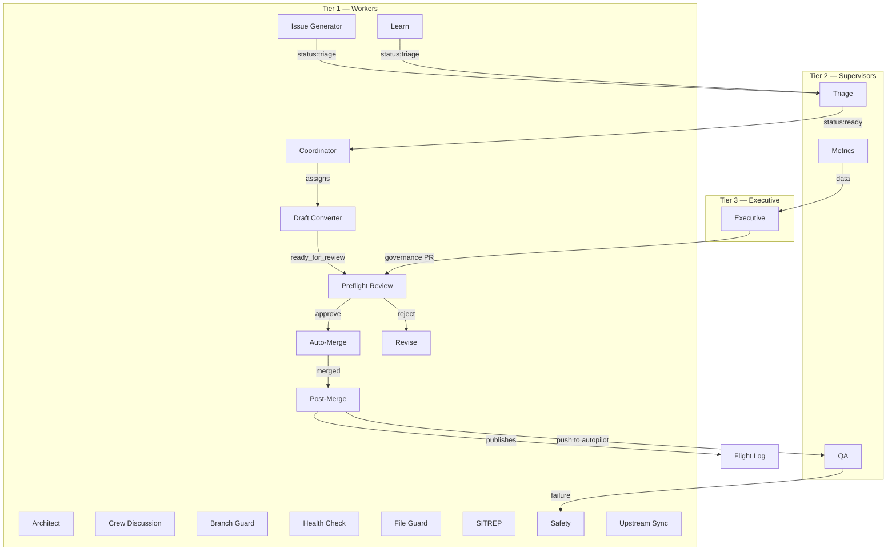

# Architecture

Auto-generated on 2026-04-08 by the Architect workflow. Do not edit manually.

## System Overview

**20 agent workflows** across 3 tiers, plus 1 composite action(s).

## Diagram

## Workflows

| Name | File | Tier | Triggers | Schedule |
|---|---|---|---|---|
| Architect | `agent-architect.yml` | Worker | schedule, manual, push | `0 0 * * 1` |
| Post-Merge | `agent-cleanup.yml` | Worker | PR event | N/A |
| Coordinator | `agent-coordinator.yml` | Worker | schedule, manual, issue event | `0 * * * *` |
| Crew Discussion | `agent-discuss.yml` | Worker | manual, discussion | N/A |
| Executive | `agent-executive.yml` | Executive | schedule, manual | `0 6 * * 4` |
| Branch Guard | `agent-guard.yml` | Worker | PR event | N/A |
| Health Check | `agent-health-check.yml` | Worker | schedule, manual | `0 6 * * *` |
| Issue Generator | `agent-issue-generator.yml` | Worker | schedule, manual | `0 0 * * *` |
| Learn | `agent-learn.yml` | Worker | manual, PR event, issue event | N/A |
| Auto-Merge | `agent-merge.yml` | Worker | review, check_suite | N/A |
| Metrics | `agent-metrics.yml` | Supervisor | schedule, manual | `0 2 * * 3` |
| File Guard | `agent-protected-files.yml` | Worker | PR event | N/A |
| QA | `agent-qa.yml` | Supervisor | schedule, manual, push | `0 4 * * *` |
| Draft Converter | `agent-ready.yml` | Worker | schedule, manual, check_suite | `*/10 * * * *` |
| SITREP | `agent-reflection.yml` | Worker | schedule, manual | `0 0 * * 3,6` |
| Preflight Review | `agent-review.yml` | Worker | manual, PR event | N/A |
| Revise | `agent-revise.yml` | Worker | review | N/A |
| Safety | `agent-safety.yml` | Worker | manual, PR event, check_suite | N/A |
| Upstream Sync | `agent-sync-upstream.yml` | Worker | schedule, manual | `0 3,9,15,21 * * *` |
| Triage | `agent-triage.yml` | Supervisor | manual, issue event | N/A |

## Composite Actions

- `publish-to-flight-log`
